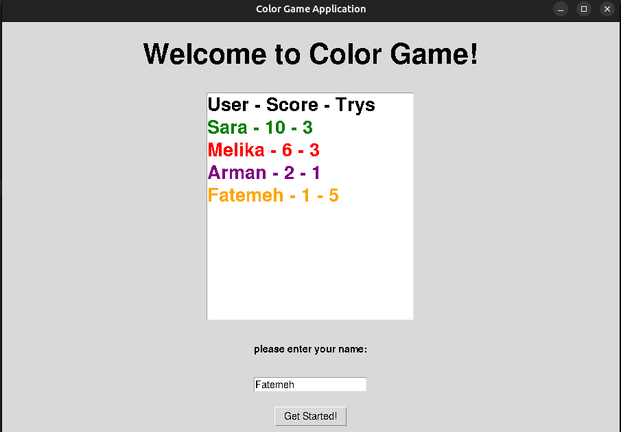

# Color Game

## Introduction
In this game, the player must enter the **color of the text** that appears on the page, and the score of the game is increased for each correct answer. The total duration of the game is **30 seconds**. The user interface displays the name of different colors with different colors, and the player must identify the color of the text and enter the correct color name to win the game.
<div style="display:flex;">
    
    
</div>

## Implementation
- [x] Designing and implementing a graphic user interface, including displaying words with different colors.
- [x] Incoming player recognition mechanism and score calculation.
- [x] Scheduling the game and checking the end of the game(30 seconds).
- [x] Buttons with Play and Restart functions on the game screen.
- [x] Show the number of times played and the highest score

## Getting started
### Set-up environment
first of all install the requirements for this project which is **tkinter** library. in order to this it is a good practise to create a seperate python environment using **venv**:
```bash
python -m venv <your-env-name>
source <your-env-name>/bin/activate
```
then install the packages listed in **requirements.txt** file:
```bash
pip install -r requirements.txt
```
### Bring up Postgresql
now using this command you will have an up and running local database in your system to store your, **users**, **scores** and **trys**.
```bash
docker compose up -d
```
### Lastly
finally run the game and enjoy!
```bash
python main.py
```